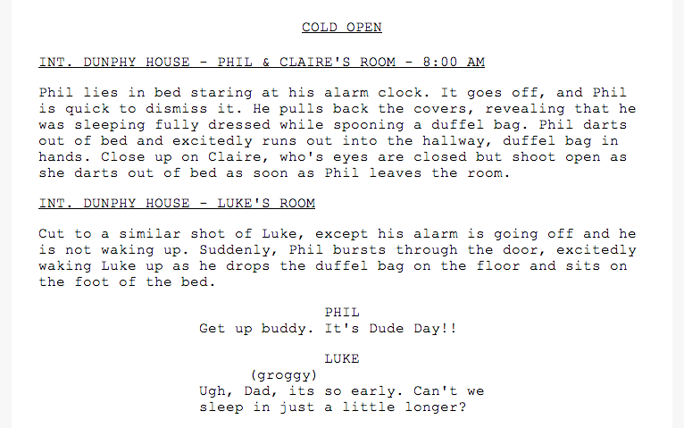

# Usage

	python scriptdown.py script.sd

Outputs html formatted to display the script.

# Script Format
## Comments

You can comment out blocks just as you can comment in 99% of programming languages. `// ...`, and `/* ... */`

## Meta Information

You can define the following meta information for your script. This will be displayed in various places within the script. The first word defines the type of meta information it is, and, after any following whitespace, the rest of the text on the line is used as the value for that metadata.

`show`    Modern Family  
`episode` Dude Day  
`author`  Luke Zilioli  
`date`    2013-08-25  
`note`    Final draft  
`\n`  
`\n`  

Follow this section with two linebreaks.

## The Script

Symbol | Indicator
------ | ---------
`#` | Scene heading
`/#` | End scene heading
`##` | Location heading
`###` | Action description
`>` | Character's Name (if proceeded with `..`, it will be CONT'D..)
(tab) | Parenthetical
(nothing) | Dialog

# Sample

## Scriptdown File

	// This is an example script for scriptdown
	show 	Modern Family
	episode Dude Day
	author 	Luke Zilioli
	date    2013-08-25
	note    Final draft

	# Cold Open
	## INT. Dunphy House - Luke's Room
	### Cut to a similar shot of Luke, except his alarm is going off and he is not waking up. Suddenly, Phil bursts through the door, excitedly waking Luke up as he drops the duffel bag on the floor and sits on the foot of the bed.

	> Phil
	Get up buddy. It's Dude Day!!

	> Luke
		groggy
	Ugh, Dad, its so early. Can't we sleep in just a little longer?

	> Phil
		looking hurt
	What? But you love this day.

## Output

	(<html>, <head> (with css), <body>)
	

		

			
Modern Family

			
Dude Day

			
Luke Zilioli

		

		
Cold Open

		
INT. DUNPHY HOUSE - Phil & Claire's Room - 8:00 AM

		
Cut to a similar shot of Luke, except his alarm is going off and he is not waking up. Suddenly, Phil bursts through the door, excitedly waking Luke up as he drops the duffel bag on the floor and sits on the foot of the bed.

		
 Phil

		
Get up buddy. It's Dude Day!!

		
 Luke

		
groggy

		
Ugh, Dad, its so early. Can't we sleep in just a little longer?

		
 Phil

		
looking hurt

		
What? But you love this day.

	

## Preview

#ToDo

* Make it support comments better
* Less error prone
* Paging, with headers at top of page
* Less syntax, auto detect switch between new speaker back to action because of skiped line
* Flag to include comments as sticky notes on page
